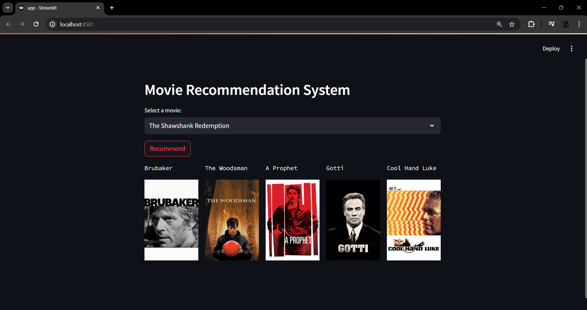

# Movies-Recommendation-System
<h2>Overview</h2>

  
This project is a movie recommendation system built using Python libraries such as Pandas, Scikit-learn, and Streamlit. The system takes a user input movie name and suggests similar movies based on a pre-trained model.

  

  <h2>Requirements</h2>

  <ul>
    <li>Python 3.x</li>
    <li>Jupyter Notebook</li>
    <li>Streamlit</li>
    <li>Pandas</li>
    <li>Scikit-learn</li>
  </ul>

  <h2>Installation</h2>

  <ol>
    <li>Clone the repository:</li>
  </ol>

  <pre><code>git clone https://github.com/JAK0707/Movies-Recommendation-System.git
  </code></pre>

  <ol start="2">
    <li>Install the required dependencies:</li>
  </ol>

  <pre><code>pip install pandas scikit-learn streamlit jupyter
  </code></pre>

  <ol start="3">
    <li>Open the Jupyter Notebook:</li>
  </ol>

  <pre><code>jupyter notebook main.ipynb
  </code></pre>

  <ol start="4">
    <li>Run each cell in the notebook sequentially to execute the code and interact with the system.</li>
  </ol>

  <h2>Usage</h2>

  <ol>
    <li>Open the Jupyter Notebook in your browser.</li>
    <li>Run each cell in the notebook sequentially to initialize the recommendation system.</li>
    <li>Follow the instructions provided in the notebook to enter the name of a movie.</li>
    <li>The system will output a list of similar movies based on the input.</li>
  </ol>

  <h2>How It Works</h2>

  <ol>
    <li><strong>Data Collection:</strong> The system uses a dataset of movies and their features (such as genres, actors, directors, etc.).</li>
    <li><strong>Data Preprocessing:</strong> The dataset is preprocessed to prepare it for training.</li>
    <li><strong>Model Training:</strong> A machine learning model is trained on the preprocessed data to learn the relationships between movies.</li>
    <li><strong>User Input:</strong> When a user enters a movie name, the system finds similar movies based on the learned relationships.</li>
    <li><strong>Recommendation:</strong> The system outputs a list of recommended movies to the user.</li>
  </ol>

  <h2>Dataset</h2>

  
The dataset used for this project is included in the repository as <code>dataset.csv</code>. It contains information about various movies including their genres, release date, summary, launguage, ratings, etc.

  <h2>Deployment</h2>

  
To deploy the web app, you will need to pickle the trained model and add it to the repository. Since the pickle file is too large, it is not included in this repository. You can follow the instructions in the notebook to pickle the model on your local machine.

  
   <h2>Future Improvements</h2>

  <ul>
    <li>Incorporate more advanced machine learning algorithms for better recommendations.</li>
    <li>Improve the user interface for better user experience.</li>
    <li>Add user preferences to personalize recommendations.</li>
  </ul>

  <h2>Contributors</h2>

  <ul>
    <li><a href="https://github.com/JAK0707">Jaiditya Abhineet Kapoor</a></li>
  </ul>

<h2>Acknowledgments</h2>

  <ul>
    <li>Thanks to <a href="https://www.kaggle.com/datasets/ahsanaseer/top-rated-tmdb-movies-10k">Kaggle</a> for providing the dataset.</li>
  </ul>

Feel free to contribute to this project by submitting pull requests or opening issues. Happy movie watching! 🍿🎬

